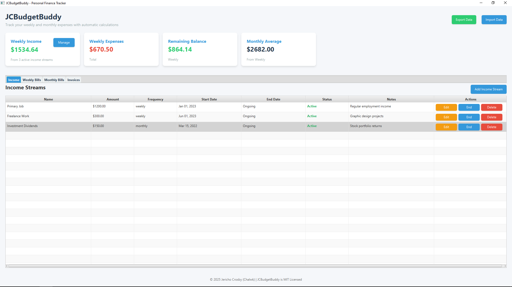
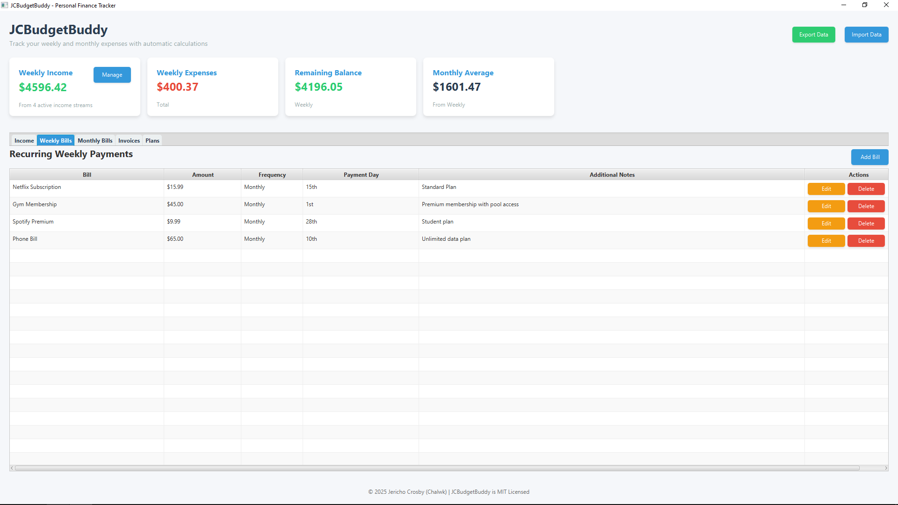
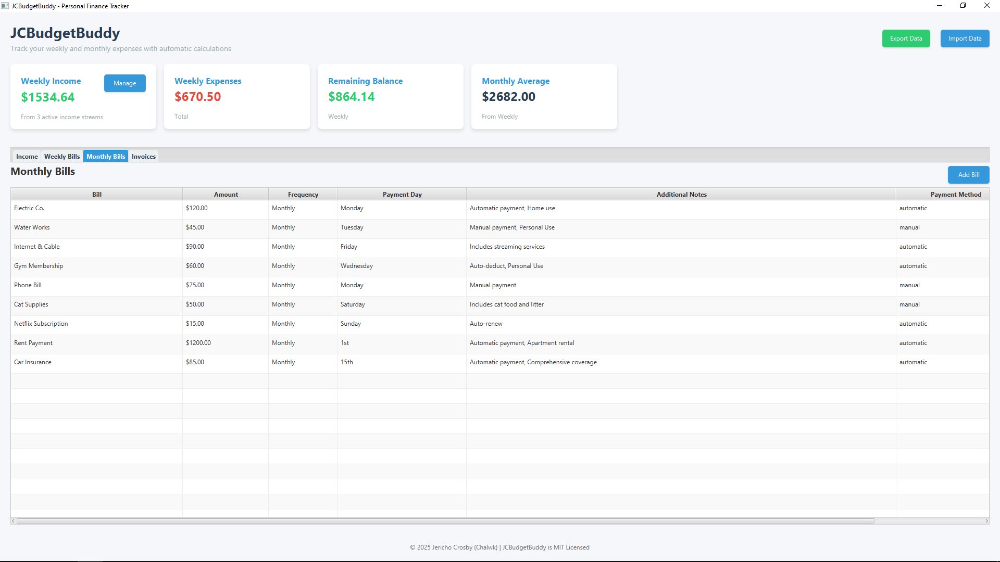
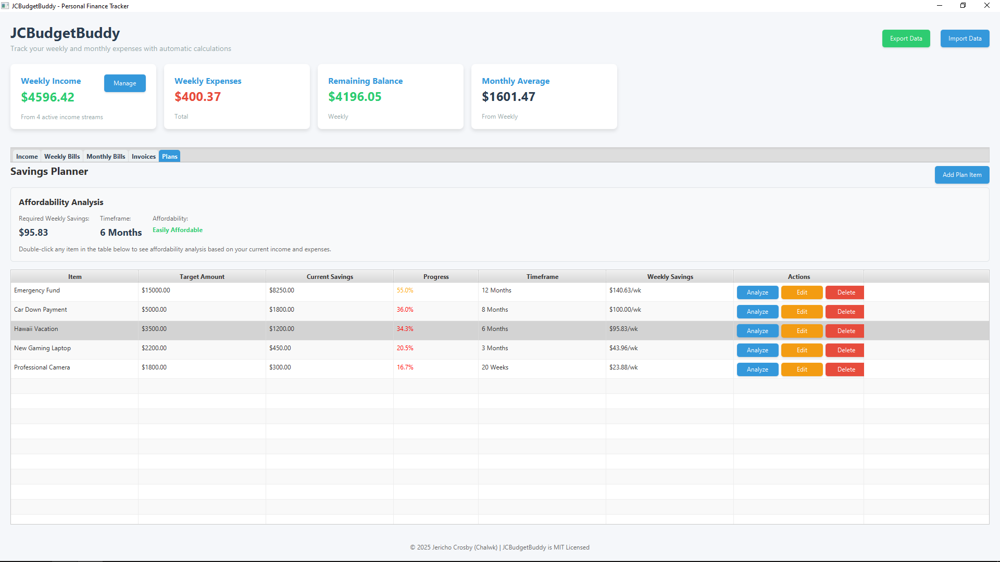

# JCBudgetBuddy

[](LICENSE)
[](https://github.com/Chalwk/JCBudgetBuddy/releases/latest)
[](https://github.com/Chalwk/JCBudgetBuddy/actions/workflows/build.yml)

A personal finance tracker built with JavaFX for managing weekly and monthly expenses, invoices, and payments.

## Features

- **Dashboard Overview** - View weekly income, expenses, remaining balance, and monthly averages
- **Bill Management** - Track weekly and monthly bills with custom frequencies and payment methods
- **Invoice Tracking** - Manage invoices with payment history and balance calculations
- **Data Persistence** - Automatic saving of user data to JSON format
- **Import/Export** - Backup and restore your financial data
- **Windows Installer** - Easy deployment with native Windows executable

---

<table>
  <tr>
    <td></td>
    <td></td>
  </tr>
  <tr>
    <td></td>
    <td></td>
    <td></td>
  </tr>
</table>

---

## Installation

1. **Run the installer** - Double-click the `JCBudgetBuddy.exe` file
2. **Security prompt** - If you see "Windows protected your PC":
    - Click "More info"
    - Click "Run anyway"
3. **Installation wizard**:
    - Click "Next" to begin
    - Accept the license agreement
    - Choose installation directory (default: `C:\Program Files\JCBudgetBuddy\`)
    - Click "Install"
4. **Permissions** - Allow permissions when prompted by the installer
5. **Completion** - Click "Finish" to complete installation

**Note**: If the installer doesn't open after the first attempt (a rare Windows 10 issue), simply run the executable
again.

After installation, you can launch JCBudgetBuddy from:

- Desktop shortcut
- Start menu (search for "JCBudgetBuddy")

---

## Building from Source

### Prerequisites

- Java 21 or later
- Gradle

### Build Commands

```bash
# Build the application
gradle build

# Create standalone distribution
gradle jlink

# Generate Windows installer
gradle jpackage
```

The built installer will be available in the `build/jpackage` directory.

### [LICENSE](LICENSE)

Licensed under the [MIT License](LICENSE).