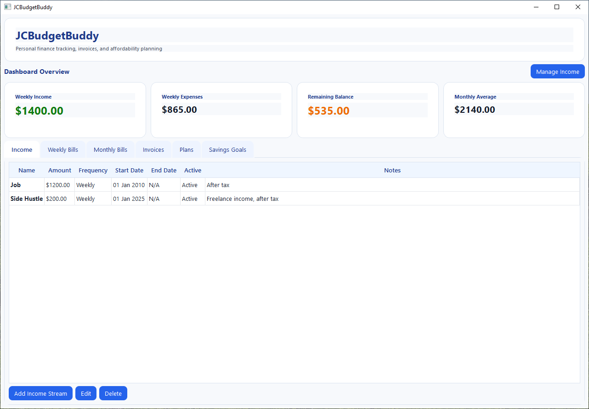
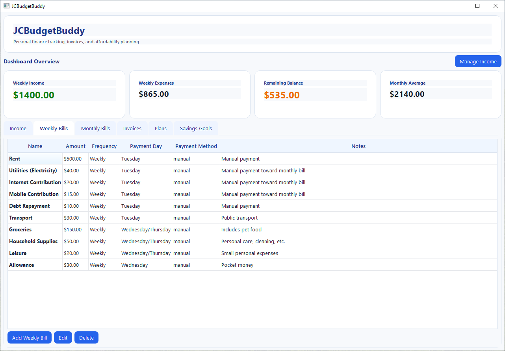
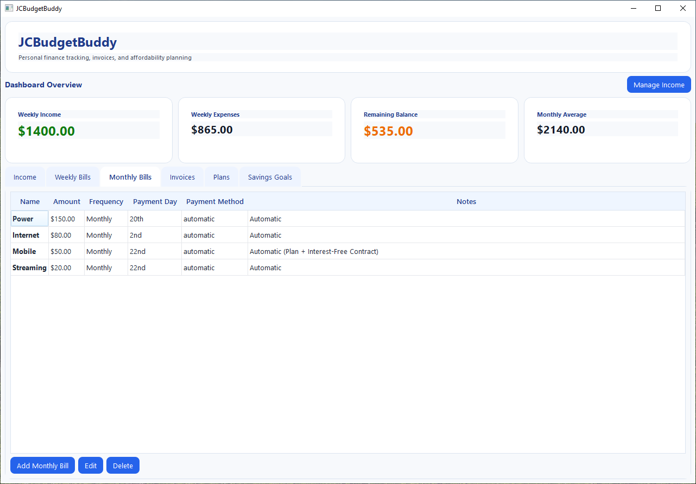
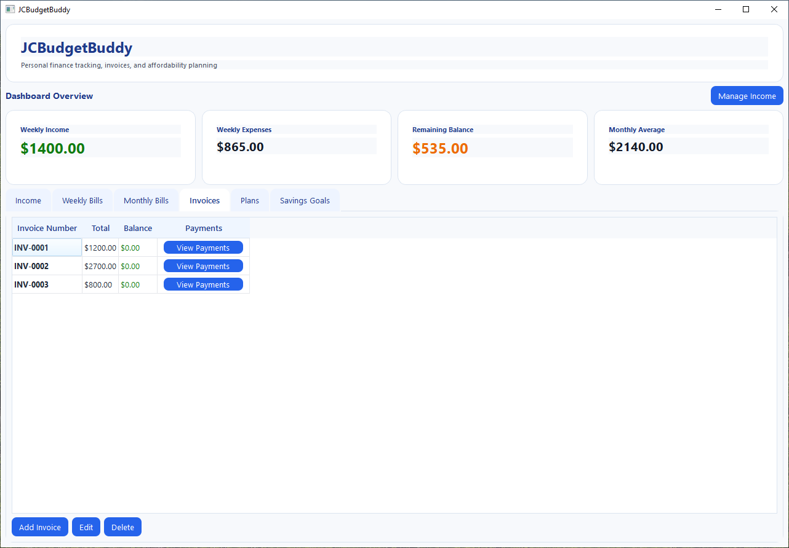
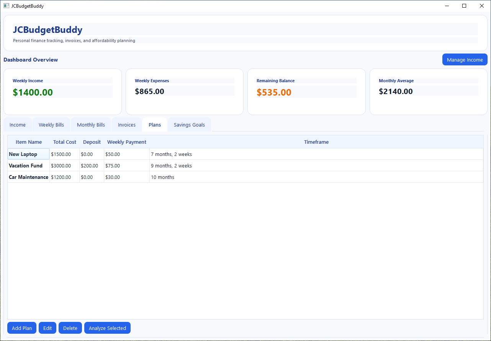
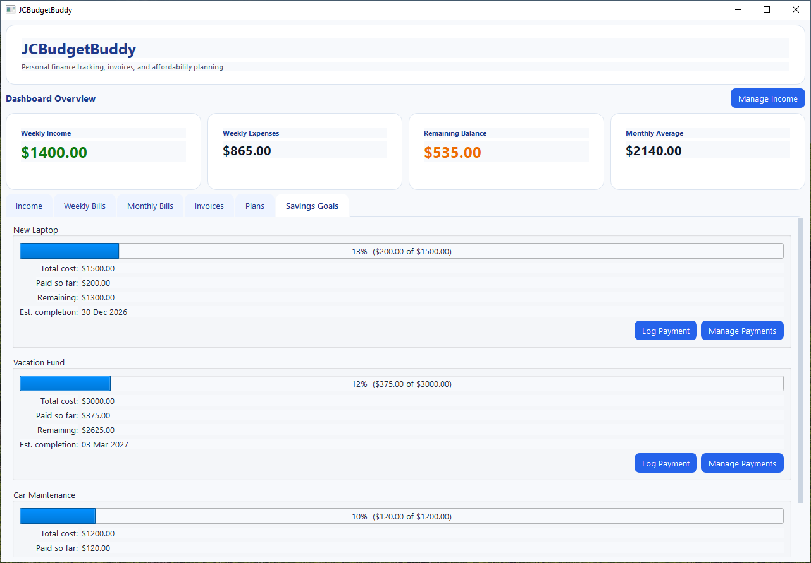
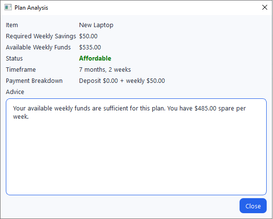
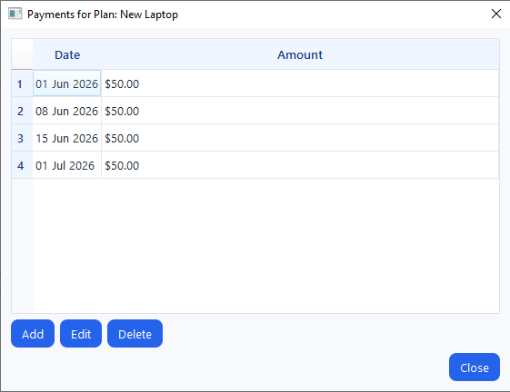
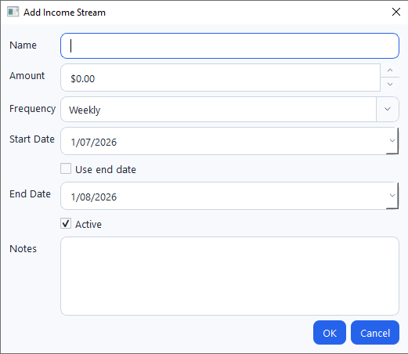
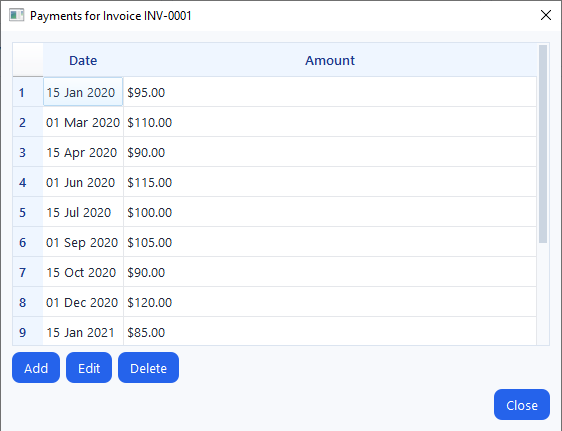

# JCBudgetBuddy

A Windows desktop personal finance tracker built with Qt Widgets, JSON persistence, and CMake for managing weekly and monthly expenses, invoices, and payments.

[](https://github.com/Chalwk/JCBudgetBuddy/releases/latest)
[](https://github.com/Chalwk/JCBudgetBuddy/blob/main/LICENSE)


---

<table>
  <tr>
    <td></td>
    <td></td>
    <td></td>
  </tr>
  <tr>
    <td></td>
    <td></td>
    <td></td>
  </tr>
  <tr>
    <td></td>
    <td></td>
    <td></td>
  </tr>
  <tr>
    <td></td>
    <td></td>
    <td></td>
  </tr>
</table>

---

## Features

- **Dashboard Overview** - View weekly income, expenses, remaining balance, and monthly averages.
- **Bill Management** - Track weekly and monthly bills with custom frequencies and payment methods.
- **Invoice Tracking** - Manage invoices with payment history and balance calculations.
- **Data Persistence** - Automatic saving of user data (`%USERPROFILE%\.JCBudgetBuddy\userdata.json`).
- **Windows Installer** - Easy deployment with an NSIS installer that adds Start Menu shortcuts and uninstall support.

---

## Getting Started

You have two options to get the application:

1. **Download the installer (recommended)**  
   Grab the latest `JCBudgetBuddySetup.exe` from the [Releases page](https://github.com/Chalwk/JCBudgetBuddy/releases).  
   The installer will:
     - Install the application to `C:\Program Files\JCBudgetBuddy`.
     - Create a Desktop shortcut and a Start Menu folder with both application and uninstall shortcuts.
     - Register the application in Windows **Add/Remove Programs** for easy uninstallation.

2. **Build from source**  
   If you prefer to compile the application yourself, follow instructions below.

---

## Requirements

- Windows 10 or 11
- Visual Studio Build Tools 2022 or 2026 with Desktop Development with C++ workload
- CMake 3.24 or newer
- Qt 6.x (MSVC 2022 64-bit build)

---

## Install Qt

1. Download and run the Qt Online Installer.
2. Select Qt 6.x for Desktop Development, ensuring the **MSVC 2022 64-bit** kit is included.
3. After installation, confirm the path exists: `C:\Qt\<version>\msvc2022_64\lib\cmake\Qt6`

---

## Build & Package

### Automated (recommended)
Run `build.bat`. It will clean, configure, build, package dependencies, and generate the NSIS installer.

### Manual steps
```bash
rmdir /s /q build
cmake -S . -B build -DQt6_DIR="C:/Qt/6.11.1/msvc2022_64/lib/cmake/Qt6"
cmake --build build --config Release
package.bat build
cd installer
makensis JCBudgetBuddy.nsi
```

> Adjust the Qt path in `build.bat` and `package.bat` if needed.
> `JCBudgetBuddySetup.exe` will appear in `/installer/`.

---

## License

This project is licensed under the **GNU General Public License Version 3, 29 June 2007**.  
Copyright (c) 2026 Jericho Crosby (Chalwk). See the [LICENSE](LICENSE) file for details.

---